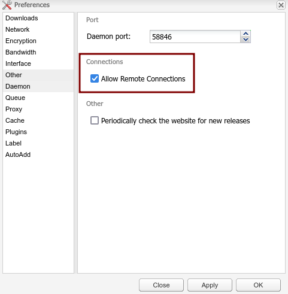

# Deluge + Flood configuration

Here is the recommended configuration for Deluge to work with Flood:

- In your ``.env`` configuration file, check that both ``FLOOD_PASSWORD`` and ``FLOOD_AUTOCREATE_USER_IN_DELUGE_DAEMON`` variables are set and that ``FLOOD_AUTOCREATE_USER_IN_DELUGE_DAEMON`` is ``true``.
- Check in your ``config.yaml`` that both ``Deluge`` and ``Flood`` are enabled.
- Run the stack: ``./run-seedbox.sh``
- Wait for services to be up and running.
- Go to Deluge UI (by default ``deluge.yourdomain.com``).
- Open Preferences
- In the "Daemon" menu, select "Allow remote connections".

- Save changes and restart Flood: ``docker restart flood`` (if necessary).
